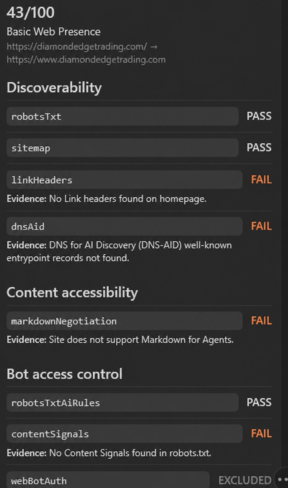

# Is It Agent Ready

Is It Agent Ready is a cross-harness skill for developers and site owners who want an evidence-based audit of a public website's readiness for AI agents. It wraps Cloudflare's public Agent Readiness Scanner behind a local safety gateway and works with Codex, Claude Code, and OpenCode.

> **Unofficial integration:** this package is not authored, sponsored, or endorsed by Cloudflare. Cloudflare controls `isitagentready.com`, its scanner behavior, recommendations, policies, and availability.

The package exposes `scan_site` for non-persistent audits and `scan_site_and_save` for explicitly retained reports. Both select a content, API/application, full, or named-check scan; preserve the scanner's evidence; and refuse local, private, internal, metadata, or credential-bearing targets before the remote call.

## Requirements

- Node.js 22, 24, or 26. CI covers every currently supported runtime line; Node.js 20 is intentionally excluded because it is end-of-life.
- Network access to `https://isitagentready.com/mcp` only when a scan is requested.
- No API key, OAuth flow, or other scanner credential.

Download or clone this repository, then use the install path for your harness.

## Codex

Add the repository as a local marketplace:

```text
codex plugin marketplace add <absolute-path-to-this-repository>
```

Open Codex, run `/plugins`, choose the `is-it-agent-ready` marketplace, install the plugin, and start a new task. The Codex manifest is `plugins/is-it-agent-ready/.codex-plugin/plugin.json`; its embedded MCP server entry launches the bundled safety gateway.

## Claude Code

In Claude Code, add the marketplace, install the plugin, and reload it:

```text
/plugin marketplace add <absolute-path-to-this-repository>
/plugin install is-it-agent-ready@is-it-agent-ready
/reload-plugins
```

Invoke it explicitly as `/is-it-agent-ready:is-it-agent-ready`, or ask Claude to audit a public site and let the skill description trigger it.

## OpenCode

Run the dependency-free installer from the repository root:

```text
node ./scripts/install-opencode.mjs
```

The installer copies the skill and gateway into the current stable OpenCode config directory, updates `opencode.json` without replacing unrelated settings, and retains a timestamped backup of an existing config. Start a new `opencode` session and invoke the `is-it-agent-ready` skill, or ask for an agent-readiness scan.

OpenCode's separate V2 preview uses an incompatible MCP config shape. Install that variant without editing JSON by running `node ./scripts/install-opencode.mjs --v2`; `opencode.v2.json` records the checkout-local V2 shape.

## Example

Request:

```text
Scan https://example.com for agent readiness using the content profile.
```

Observed scanner output on 2026-08-04 (excerpt; the upstream result can change as the site or scanner changes):

```text
# Agent Readiness: https://example.com

**Level 0/5 -- Not Ready**

## Discoverability (0/4 passing)
- FAIL robotsTxt -- Publish /robots.txt with clear crawl rules
  robots.txt not found
- FAIL sitemap -- Publish a sitemap and reference it from robots.txt
  sitemap.xml not found

## Content Accessibility (0/1 passing)
- FAIL markdownNegotiation -- Support Accept: text/markdown content negotiation for machine-readable content
  Site does not support Markdown for Agents
```

Public report route: [isitagentready.com/example.com](https://isitagentready.com/example.com)

## Saving scans

Ask the agent to save or retain the scan to use `scan_site_and_save`. Ordinary `scan_site` calls never create local files.

Every successful save is committed atomically as one directory containing:

- `scan.json`: the complete returned MCP result plus the validated request, scan ID, and save timestamp.
- `report.md`: the readable text report with the same scan ID, target, timestamp, and scan scope.
- `report.html`: a self-contained, dependency-free viewer with the score, categories, status, and failure evidence in the compact report layout.

The tool returns both absolute paths. Default storage locations are:

- Windows: `%LOCALAPPDATA%\is-it-agent-ready\scans\<scan-id>`
- macOS: `~/Library/Application Support/is-it-agent-ready/scans/<scan-id>`
- Linux: `${XDG_STATE_HOME:-~/.local/state}/is-it-agent-ready/scans/<scan-id>`

Set `IS_IT_AGENT_READY_SCAN_DIR` to an absolute path before starting the harness to use another controlled location. Saving never accepts an arbitrary output path from a tool call, so scanned content cannot redirect writes elsewhere.

The viewer displays a transparent 100-point applicable-check pass rate: passing applicable checks divided by all applicable checks, rounded to the nearest whole number. Excluded checks do not count. This viewer score is not Cloudflare's 1–5 maturity level and is never calculated for a partial or internally inconsistent result. The HTML uses only embedded CSS, makes no network requests, runs no JavaScript, and keeps color limited to pass, fail, warning, and excluded status text.



_Representative saved-report output from the observed `diamondedgetrading.com` content-profile scan on 2026-08-04. The site and upstream scanner can change, so future results may differ._

## Safety boundaries

Scanning sends the approved target URL to Cloudflare and causes Cloudflare to request that public site. The local gateway validates before any scanner request:

- Only absolute `http` and `https` URLs are accepted.
- URLs with usernames, passwords, query strings, or fragments are rejected.
- Localhost, loopback, link-local, private, shared, multicast, reserved, documentation, `.local`, `.internal`, `.localhost`, `.lan`, intranet, and known cloud-metadata targets are rejected.
- Hostnames are resolved first; any non-public IPv4 or IPv6 answer blocks the scan.
- Invalid profile and `enabledChecks` values are rejected locally.
- Timeout, rate-limit, malformed, partial, and upstream-error results never receive a fabricated score.

An ordinary scan is read-only with respect to your repository and local storage. An explicitly saved scan writes only to the application-data scan store described above. DNS, credentials, authentication, payments, deployment, production changes, and externally visible remediation require separate approval.

## Limitations

- Agent-readiness scores are directional diagnostics, not security assurance, compliance evidence, or production certification.
- Several checks cover emerging or draft standards. Implement only capabilities that the product genuinely supports.
- The upstream scanner currently negotiates MCP `2025-06-18` without a protocol session. The package also documents the released `2025-11-25` transport and the incompatible `2026-07-28` draft; it does not pretend the live service has adopted the draft.
- DNS can change between local validation and Cloudflare's request. The gateway blocks every address it observes, but no client-side check can eliminate that external time-of-check/time-of-use gap.
- Service availability, rate limits, scoring, check definitions, and public report content remain upstream-controlled.
- Saved reports contain public scanner evidence and are generated artifacts. Do not commit or publish them unless intentionally promoted.
- OpenCode's V2 plugin/config APIs are still evolving. The default install targets stable `mcp.<name>`; the explicit `--v2` install targets preview `skills` and `mcp.servers`.

## Development and verification

All required offline checks use only built-in Node.js modules:

```text
npm run validate
npm test
npm run smoke:offline
```

The live contract and fixture check is separate:

```text
npm run test:live
```

Network downtime and rate limits produce a CI warning; a successful handshake with a changed tool schema or malformed fixture response fails the live job. See [the compatibility matrix](docs/compatibility.md) for platform-specific formats and source links.

## License

MIT. See [LICENSE](LICENSE).
